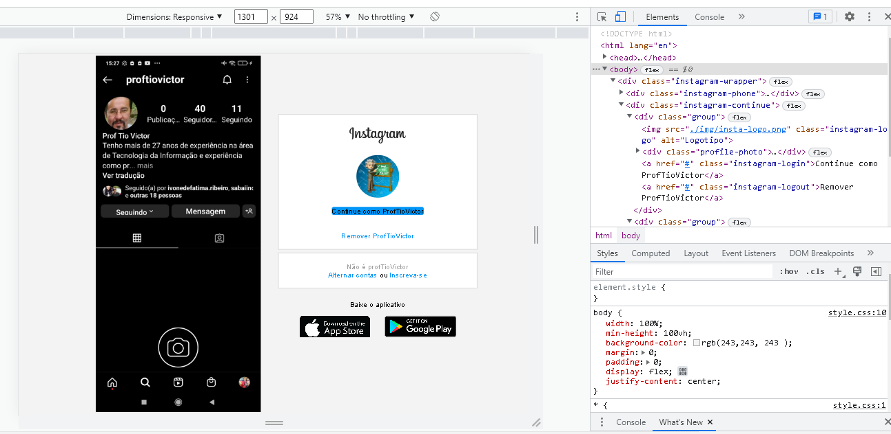
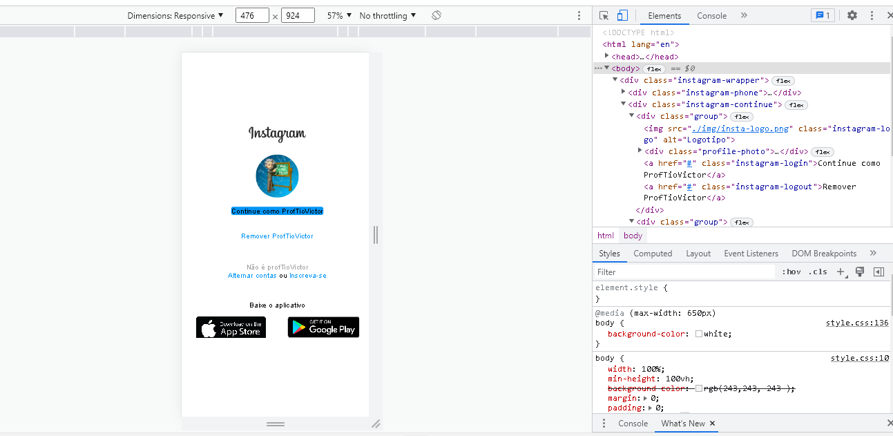

 

<H1>Flexbox_CSS</H1>

## Página Inicial do Instagram - 2022

  
 
 
Nesse projeto o desafio é reconstruir a página web responsiva de login do Instagram.

 
## Tecnologia 
 
Aqui estão as tecnologias usadas neste projeto
 
* HTML 5
* CSS
    - Flexbox #Layout flexível permite que os elementos responsivos dentro de um contêiner sejam organizados automaticamente, dependendo do tamanho da tela.
    - @media  # permite a renderização de conteúdo para se adaptar a diferentes condições, como a resolução da tela.
   
 
## Software usado
 
* Visual Studio Code
 
## Resultados

 
## Conclusão

Com este projeto simples podemos demonstrar a utilização do CSS, com layout flexível, através do flexbox.
 
 
## Links
 
  - Repositório: https://github.com/vicssb/PaginaInicialInstagram
    - Em caso de bugs sensíveis, como vulnerabilidades de segurança, entre em contato
      diretamente em vez de usar o rastreador de problemas. Valorizamos o seu esforço
      para melhorar a segurança e privacidade deste projeto!
 
 
## Versão
 
1.0.0.0
 
 
## Autor
 
* **Victor Sérgio Silva Barros**: 

- @vicssb (https://github.com/vicssb)
 

  

  

  

  

Por favor, siga o github e junte-se a nós!
Obrigado por me visitar e boa codificação!

